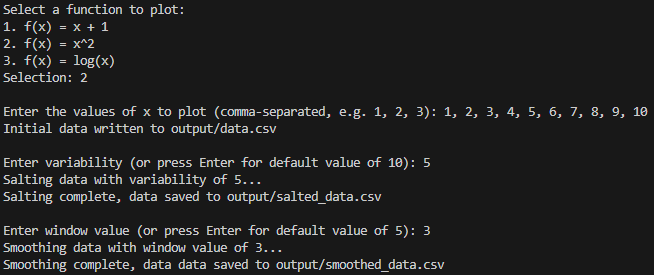

# Plotter, Salter, Smoother - Original

## Overview

This project implements functionality for plotting, salting, and smoothing data. It includes a `DataBuilder` class for creating data, a `Salter` class for salting data, and a `Smoother` class for smoothing salted data.

## Class Descriptions

`Main`: This class is the entry point of the program. It initializes the `DataBuilder`, `Salter`, and `Smoother` classes, and orchestrates the flow of the program by calling their methods in sequence.

`DataBuilder`: This class is responsible for creating data. It starts by prompting the user to select a function, which will be used to generate the data. The user can choose from a list of functions, including `f(x) = x + 1`, `f(x) = x^2`, and `f(x) = log(x)`. Then, the user is prompted to enter a series of comma-separated x values, which will be used to generate the data. Next, the class generates the y values by applying the selected function to each x value. Finally, the class writes the data to a CSV file, `data.csv`, in the format `x,y`.

`Salter`: This class is responsible for salting the data. It reads the data from the CSV file, `data.csv`, and applies a simple salting algorithm to the y values. The salting algorithm adds a random value between `-variability` and `variability` to each y value, which is generated using the `random` module. `variability` is a user input that can be set to any value, or 10 by default. The salted data is then written to a new CSV file, `salted_data.csv`, in the same format as the original data.

`Smoother`: This class is responsible for smoothing the salted data. It reads the salted data from the CSV file, `salted_data.csv`, and applies a simple smoothing algorithm to the y values. The smoothing algorithm calculates the average of all y values in a given window, which is defined by the `windowValue` parameter. The `windowValue` is also a user input that can be set to any value, or 5 by default. The smoothed data is then written to a new CSV file, `smoothed_data.csv`, in the same format as the original data.

## How to Run

1. Navigate to the `/src` directory.
2. Run the `Main.java` file.
3. Follow the prompts to select a function and enter x values.
4. The program will generate the data, salt it, and smooth it, writing the results to the respective CSV files, in the `/output` directory. (An example of the output is provided in the `example_output` directory.)

## Plotted Data

Three data sets were generated using the same function but with varying parameters, in order to visualize the differences in the results. Each sheet contains the original data, salted data, and smoothed data. These tables are plotted both individually (on their own graphs) and collectively (on a combined graph) for an easy visual analysis. Additionally, a comparison sheet displays overlaid plots from all three data sets, showing how different parameter choices can affect the results. Finally, the comparison sheet also compares the differences with individual parameters, such as `variability` = `10` vs. `variability` = `30`. This sheet can be found in the current directory, labeled as `11. Plotter Salter Smoother - Original.xlsx`, or can be viewed in the images below.

## Plotted Data Takeaways

Each of the graphs provide some unique insight into the data and how the different parameters affect the results. For instance, as expected a larger `variability` value results in a more noisy graph, where the y values are less accurate to the original y values. The `windowValue` parameter also influences the smoothed data, where a larger `windowValue` results in a smoother graph, as the average is less affected by any particular y value. The same conclusions could have been drawn from the tables themselves, however, the graphs provided an easier to grasp visual representation of the data.

## Images

#### Console output:

#### Data.csv:

#### Salted_data.csv:

#### Smoothed_data.csv:

#### Original_Salted_Smoothed.png:

### Comparison.png:

TODO:

- [X] Modify `variability` and `windowValue` to be user inputs, rather than values set in the source code.
- [X] Update the README to reflect the changes made above.
- [X] Add a screenshot of the plotted data to the submission document.
