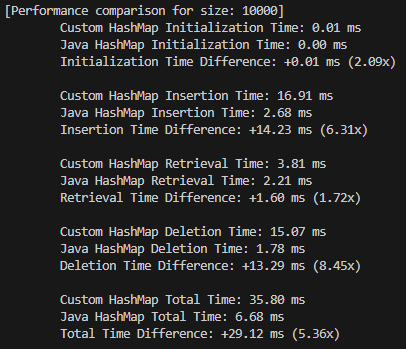

# Custom HashMap: Submission

## Overview

This project creates a custom HashMap in Java. It includes a `CustomHashMap` class that implements the basic functionality of a HashMap, including `put`, `get`, and `remove` methods. This class uses an array of linked lists to store the key-value pairs, and handles collisions using chaining. It also includes an `Entry` class that represents an individual key-value pair within the HashMap. Next, it includes a `CustomHashMapTester` class that contains tests to ensure the functionality of the `CustomHashMap` class along with performance tests compared to the built-in `HashMap` class. Finally, it includes a `Main` class that serves as the entry point to the program.

## Javadoc

The Javadoc for the project is available at the following link: [Custom HashMap Javadoc](https://custom-hashmap-docs.tylermong.dev/)

## Class Descriptions

`Main`: This class is the entry point of the program. It initializes the `CustomHashMapTester` class and calls its `runAllTests` method to execute all the tests.

`CustomHashMap`: This class implements the basic functionality of a HashMap. It uses an ArrayList of LinkedLists of `Entry` objects to store the key-value pairs. The `put` method adds a new key-value pair to the HashMap. The `get` method retrieves the value associated with a given key. The `remove` method removes a key-value pair from the HashMap. The `contains` method checks if a given key is present in the HashMap. The `size` method returns the number of key-value pairs in the HashMap. Internally, it uses a hash function, in the `hash` method, to map keys to indices in the array. It also dynamically resizes the array when the load factor exceeds a certain threshold, using the `resize` method.

`Entry`: This class represents an individual key-value pair within the HashMap. It contains a key and value, and uses generic types to allow for any type of key and value. The `getKey` and `getValue` methods return the key and value, respectively, and the `setValue` method allows for updating the value associated with a key.

`CustomHashMapTester`: This class contains tests to ensure the functionality of the `CustomHashMap` class. It includes tests for initializing the HashMap, putting, getting, and removing key-value pairs, checking if a key is present, and implicitly testing the hashing and resizing functionality. It also includes performance tests that compare the performance of the `CustomHashMap` class with the built-in `HashMap` class. It times the aforementioned operations for both classes for different sizes of data (1k, 10k, 100k, and 1M) over 10 iterations and prints the results to the console. The `performanceComparisonWithSize` method is used to run these tests and can be publicly called with `size` and `runs` parameters, if the user wants to run the performance tests with different parameters.

## How to Run

1. Navigate to the `/src` directory.
2. Run the `Main.java` file.
3. The program will run all the tests and print the results to the console.

## Graphed Data

The results of the performance tests along with some additional comparisons are stored in the `12. Custom HashMap.xlsx` file, which can be found in the current directory, or viewed in the images below. Specifically, these insights are focused around two graphs: "Total Execution Time vs Input Size" and "Custom vs Java Total Time Ratio by Input Size". The first graph shows the total execution time for both the `CustomHashMap` and Java's `HashMap` for various input sizes (1k, 10k, 100k, and 1M). The second graph shows the ratio of the total execution time of the `CustomHashMap` to that of Java's `HashMap` for the same input sizes. These graphs provide a visual representation of the performance of the `CustomHashMap` compared to Java's built-in `HashMap`.

## Graphed Data Takeaways

The two graphs provide some interesting insight into how both the `CustomHashMap` and Java's `HashMap` scale with growing input sizes. The first graph shows that the `CustomHashMap` has a higher total execution time compared to Java's `HashMap` for all input sizes, which is to be expected given the lack of optimizations the `CustomHashMap` has compared to Java's `HashMap`. However, the second graph shows that the ratio of the total execution time of the `CustomHashMap` to that of Java's `HashMap` decreases as the input size increases. This alone indicates that the `CustomHashMap` is able to scale more efficiently than Java's `HashMap` as the input size increases. With this being said, taking the data at face value would be misleading, for a number of reasons, including the size of the input data and the small number of runs. Overall, while the `CustomHashMap` is overall slower than Java's `HashMap`, the scaling of the `CustomHashMap` looks promising, and with further optimizations, it could come close to 1:1 performance with Java's `HashMap`.

## Images

#### Custom HashMap Tests:

#### HashMap Comparison 1k:

#### HashMap Comparison 10k:

#### HashMap Comparison 100k:

#### HashMap Comparison 1M:

### Graphed Data

TODO

- [X] Implement better hash function.
- [X] Abstract testing from Main class into a separate class.
- [X] Comment all code.
- [X] Generate and host JavaDocs.
- [X] Write submission document.
- [X] Implement runs parameter for performance tests.
