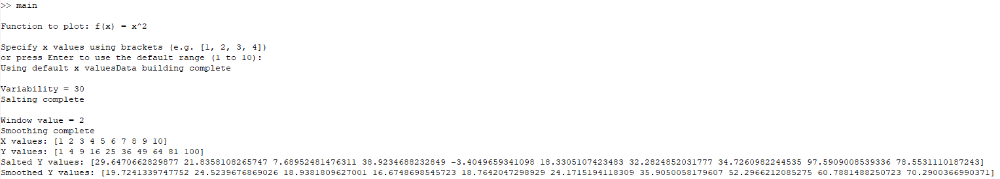
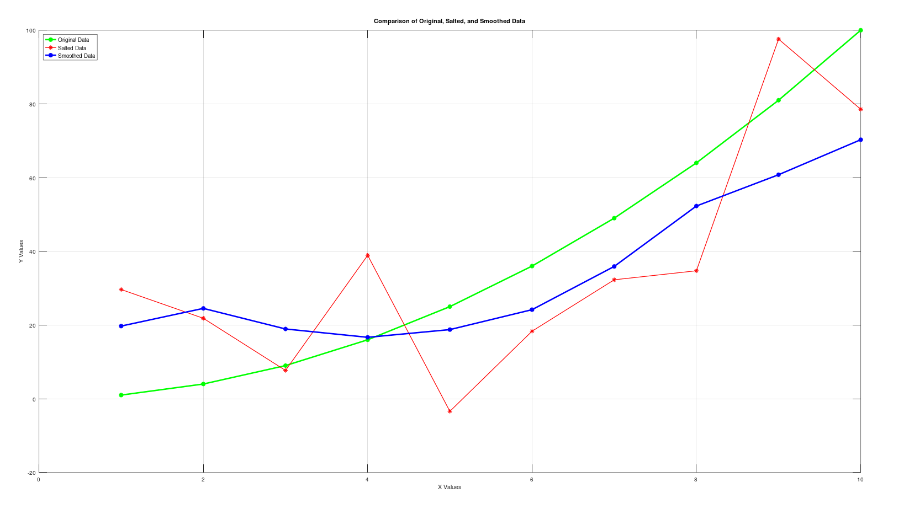

# Plotter Salter Smoother - Octave

## Overview

This project replicates the functionality of the Plotter Salter Smoother project in Octave. It includes a `main` script for calling each function in sequence, a `databuilder` function for creating data, a `salter` function for salting data, a `smoother` function for smoothing salted data, and a `plotalldata` function for plotting the data.

## File Descriptions

`main`: This script is the entry point of the program. It calls the `databuilder`, `salter`, and `smoother` functions in sequence, and passes the necessary parameters to each function.

`databuilder`: This function is responsible for creating data. It uses the function `f(x) = x^2` to generate the data. It prompts the user to enter a list of x values, or generates a list of values from 1 to 10 if no input is provided. It then generates the y values by applying the x values to the function. It returns both the x and y values.

`salter`: This function is responsible for salting the data. It takes the x and y values as input, and applies a simple salting algorithm to the y values. The salting algorithm adds a random value between `-variability` and `variability` (which is set to 30) to each y value. The salted y values are returned.

`smoother`: This function is responsible for smoothing the salted data. It takes the x and salted y values as input, and applies a smoothing algorithm to reduce noise. The smoothing algorithm calculates the average of all y values in a given window, which is defined by `windowValue` (which is set to 2). The smoothed y values are returned.

`plotalldata`: This function is responsible for plotting the data. It takes the x, y, salted y, and smoothed y values as input, and plots them on a single graph.

## How to Run

1. Open Octave.
2. Navigate to the directory containing the project files.
3. Run the `main` script.
4. When prompted, enter a list of x values or press Enter to use the default list.
5. The program will generate the data, salt it, and smooth it, and then plot the results.

## References

In order to learn Octave's syntax, I read through the official [documentation](https://docs.octave.org/latest/). More specifically some of the pages I referenced were:
- [1.3.3 Printing Notation](https://docs.octave.org/latest/Printing-Notation.html)
- [3.3 Object Sizes](https://docs.octave.org/latest/Object-Sizes.html)
- [4.2 Ranges](https://docs.octave.org/latest/Ranges.html)
- [5.4.2 Numerical Data and Strings](https://docs.octave.org/latest/Numerical-Data-and-Strings.html)
- [6.4 Comma-Separated Lists](https://docs.octave.org/latest/Comma_002dSeparated-Lists.html)
- [8.3 Arithmetic Operators](https://docs.octave.org/latest/Arithmetic-Ops.html)
- [10.1 The if Statement](https://docs.octave.org/latest/The-if-Statement.html)
- [10.5 The for Statement](https://docs.octave.org/latest/The-for-Statement.html)
- [11.2 Defining Functions](https://docs.octave.org/latest/Defining-Functions.html)
- [11.3 Returning from a Function](https://docs.octave.org/latest/Returning-from-a-Function.html)
- [11.4 Multiple Return Values](https://docs.octave.org/latest/Multiple-Return-Values.html)
- [11.10 Function Files](https://docs.octave.org/latest/Function-Files.html)
- [11.11 Script Files](https://docs.octave.org/latest/Script-Files.html)
- [14.1.1 Terminal Output](https://docs.octave.org/latest/Terminal-Output.html)
- [14.1.2 Terminal Input](https://docs.octave.org/latest/Terminal-Input.html)
- [15.2.1 Two-Dimensional Plots](https://docs.octave.org/latest/Two_002dDimensional-Plots.html)
- [15.2.3 Plot Annotations](https://docs.octave.org/latest/Plot-Annotations.html)
- [15.2.7 Manipulation of Plot Windows](https://docs.octave.org/latest/Manipulation-of-Plot-Windows.html)
- [26.1 Descriptive Statistics](https://docs.octave.org/latest/Descriptive-Statistics.html)
- [26.6 Random Number Generation](https://docs.octave.org/latest/Random-Number-Generation.html)

## Images

#### Console Output:

#### Plotted Data:
