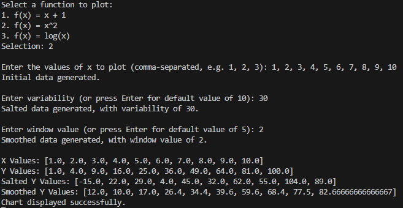
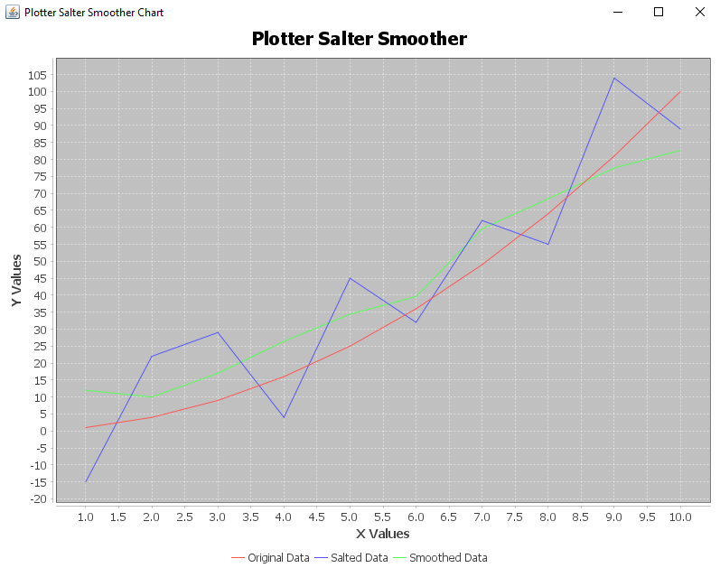

# Plotter Salter Smoother - API: Submission

## Overview

This project replicates the functionality of the Plotter Salter Smoother project using JFreeChart to graph the data. It includes a `APIDataBuilder` class for creating data, a `APISalter` class for salting data, a `APISmoother` class for smoothing salted data, and a `APIPlotData` class for plotting the data.

## File Descriptions

`Main`: This class is the entry point of the program. It initializes the `APIDataBuilder`, `APISalter`, `APISmoother`, and `APIPlotData` classes, and orchestrates the flow of the program by calling their methods in sequence.

`APIDataBuilder`: This class is responsible for creating data. It starts by prompting the user to select a function, which will be used to generate the data. The user can choose from a list of functions, including `f(x) = x + 1`, `f(x) = x^2`, and `f(x) = log(x)`. Then, the user is prompted to enter a series of comma-separated x values, which will be used to generate the data. Next, the class generates the y values by applying the selected function to each x value.

`APISalter`: This class is responsible for salting the data. It reads and applies a simple salting algorithm to the y values. The salting algorithm adds a random value between `-variability` and `variability` to each y value, which is generated using the `random` module. `variability` is a user input that can be set to any value, or 10 by default.

`APISmoother`: This class is responsible for smoothing the salted data. It reads and applies a simple smoothing algorithm to the y values. The smoothing algorithm calculates the average of all y values in a given window, which is defined by the `windowValue` parameter. The `windowValue` is also a user input that can be set to any value, or 5 by default.

`APIPlotData`: This class is responsible for plotting the data. It uses JFreeChart to create a line chart of the original, salted, and smoothed data, which is passed in from `Main`.

## How to Run

1. Navigate to the `/src` directory.
2. Run the `Main.java` file.
3. Follow the prompts to select a function and enter x values.
4. The program will generate the data, salt it, smooth it, and graph it, writing the results to the command line as well.

## References

In order to learn JFreeChart's API, I read through the official [documentation](https://www.jfree.org/jfreechart/api/javadoc/overview-summary.html). More specifically I would Google my question and refer to the top ranking pages. Some of the pages I referenced were:
- [createXYLineChart](https://www.jfree.org/jfreechart/api/javadoc/org/jfree/chart/ChartFactory.html#createXYLineChart-java.lang.String-java.lang.String-java.lang.String-org.jfree.data.xy.XYDataset-org.jfree.chart.plot.PlotOrientation-boolean-boolean-boolean-)
- [XYSeriesCollection](https://www.jfree.org/jfreechart/api/javadoc/org/jfree/data/xy/XYSeriesCollection.html#XYSeriesCollection--)
- [XYSeries](https://www.jfree.org/jfreechart/api/javadoc/org/jfree/data/xy/XYSeries.html#XYSeries-java.lang.Comparable-)
- [ChartPanel](https://www.jfree.org/jfreechart/api/javadoc/org/jfree/chart/ChartPanel.html)

## Images

#### Console Output:

#### Plotted Data:
