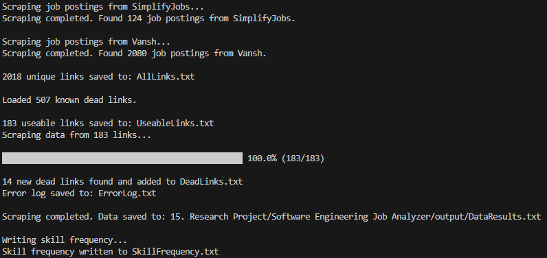
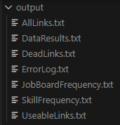
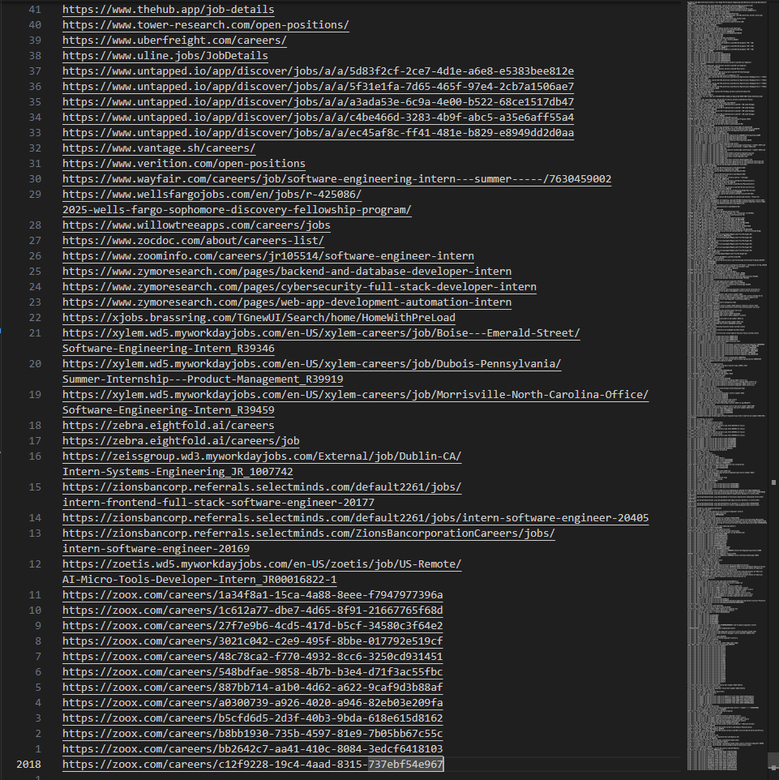
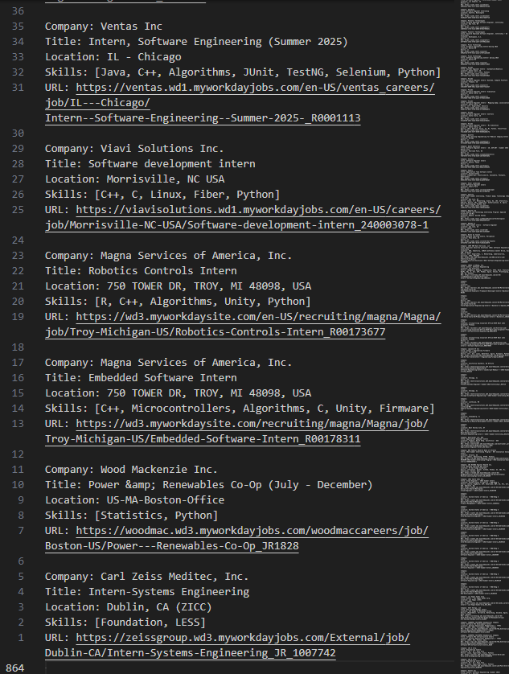
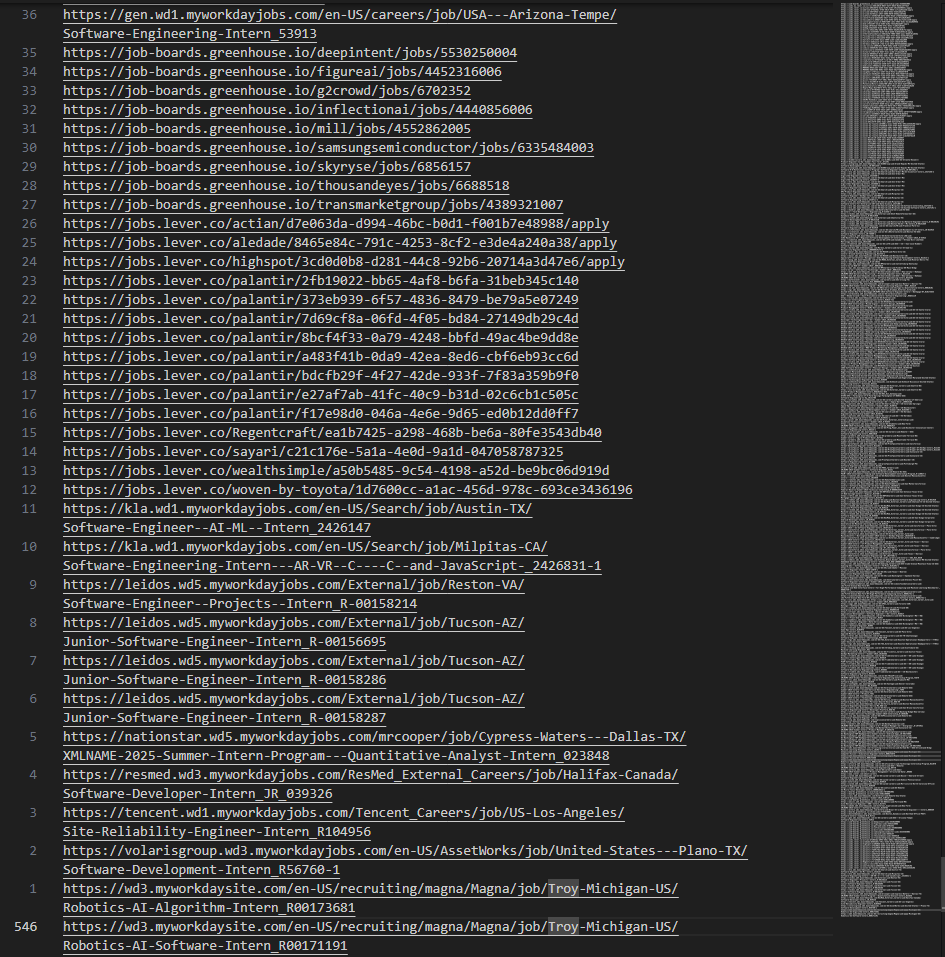
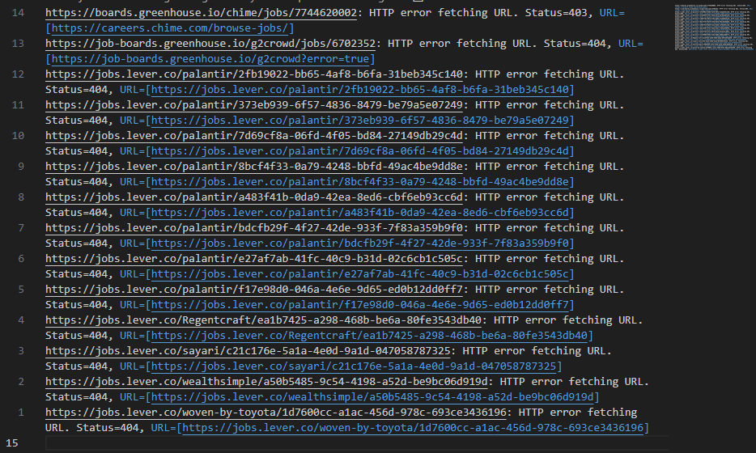
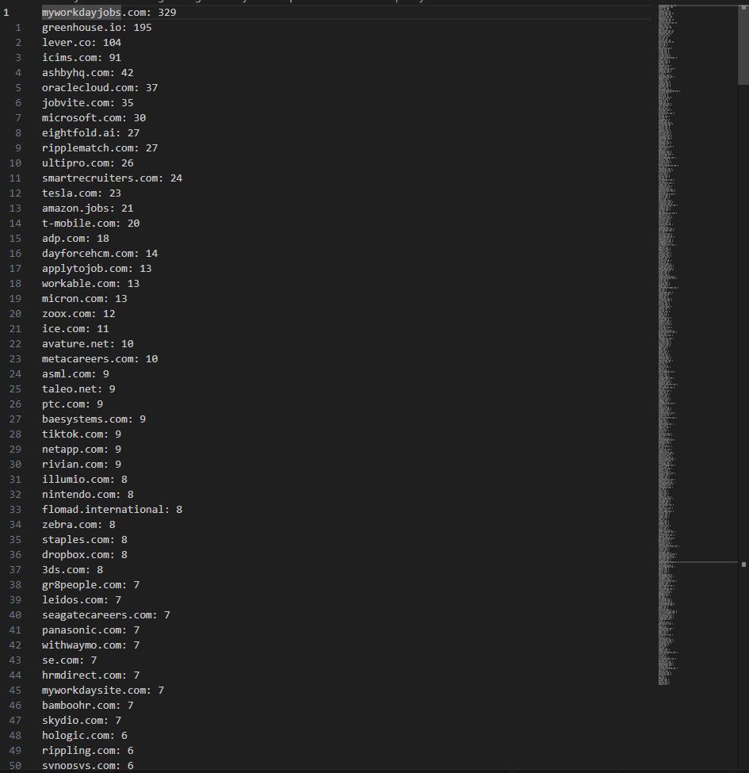
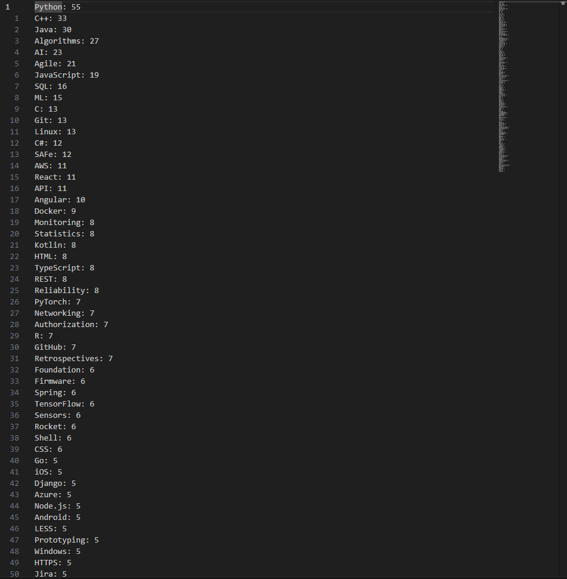
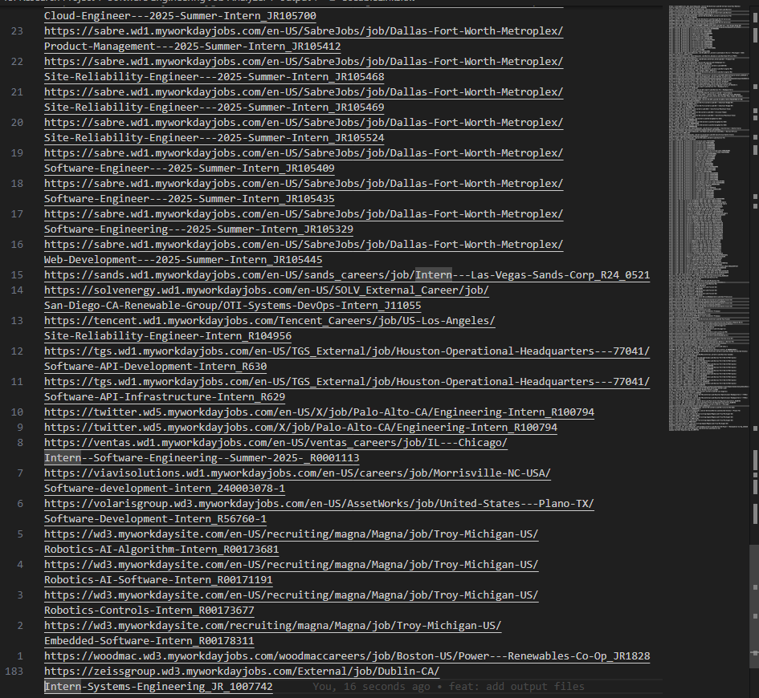

# Research Project: Submission

## Overview

This project has two main components: the "software engineering job analyzer" used to generate a dataset of internship postings for the research paper, and the research paper itself.

### Software Engineering Job Analyzer Overview

From a high-level perspective, this program follows the following sequence in order to generate data (a more detailed overview will be provided below.):

1. **Generate Links**: Scrapes two GitHub repositories to generate a list of links to internship postings.
2. **Filter Links**: Filters the links to only include those that are compatible with the data scarpers (Workday, Greenhouse, and Lever).
3. **Scrape Data**: Scrapes the filtered links to extract relevant data, including company name, job title, location, skills, and URL.
4. **Generate Dataset**: Generates the frequency of skills found in the postings.

### Research Paper Overview

The research paper is a separate document that follows the IMRaD format, (Abstract), Introduction, Methodologies, Results, Discussion, (and Conclusion).

#### Abstract
Provides a brief overview of the paper, including the topic, most popular skills, some insights, and limitations.

#### Introduction
Introduces the topic of software engineering internships, the contents of the dataset, and the results section.

#### Methodologies
Describes the methods used to generate the dataset, including the link and data scraping processes.

#### Results
This section has two main subsections: the first is a table of the top ten most popular skills, and the second is a collection of statistical methods taught throughout the course, applied to the topic of software engineering.

#### Discussion
Analyzes the results of the dataset, including the most popular skills, the takeaways, limitations, and areas for improvement.

#### Conclusion
Summarizes the paper and provides a brief overview of the dataset.

## Software Engineering Job Analyzer Mid-Level Overview

The following is a mid-level overview of the software engineering job analyzer. It describes the primary components of the program and their interactions. It is not a detailed overview, but it provides a good understanding of the program's structure and functionality.

`Main.java`: This file is the main entry point for the program. It initializes a `JobScrapingService` object with the link and data scrapers, and then calls the `scrapeAndWrite` method to start the scraping process.

`/scraper/ScraperFactory.java`: This file is used to create the link and data scrapers. It contains two methods, `createLinkScraper` and `createDataScraper`, which return a list of link scrapers and a map of data scrapers, respectively. The link scrapers are used to scrape the links from the GitHub repositories, and the data scrapers are used to scrape the data from the filtered links.

`/scraper/data/*`: This directory contains the `DataScraper` interface and its implementations for each job posting platform (Workday, Greenhouse, and Lever). Each implementation contains the logic for scraping the relevant data from the job postings, with the `scrapeJob` method.

`/scraper/link/*`: This directory contains the `LinkScraper` interface and its implementations for each GitHub repository. Each implementation contains the logic for scraping the links from the repositories, with the `scrapeLinks` method. They also include the `countJobBoardFrequencies` and `writeFrequenciesToFile` methods, which are used to count the frequencies of job boards. This was used to determine the most popular job boards, in order to build scrapers for them.

`/util/PrgressBar.java`: A progress bar used to indicate the progress of the scraping process. Due to the time to complete the scraping, it provides visual feedback to the user about the ongoing operations. 

`/util/SkillKeywords.java`: This file contains a set of keywords used to identify the skills in the job postings. It is used by the data scrapers to extract the relevant skills from the job postings.

`JobScrapingService.java`: This file contains the majority of the logic for the scraping process. A general overview of the process is as follows:
1. From the GitHub repositories, scrape all the links and output them to `/output/AllLinks.txt`.
2. Load known dead links from `/output/DeadLinks.txt`, to speed up the scraping process.
3. Filter the links to only include those that are compatible with the data scrapers (Workday, Greenhouse, and Lever). Save the useable links to `/output/UseableLinks.txt`.
4. Scrape the useable links to extract the relevant data, including company name, job title, location, skills, and URL. Save the data to `/output/DataResults.txt`. Also add any dead links to `/output/DeadLinks.txt`, to be used in future runs.

## How to Run

1. Navigate to the `/src` directory.
2. Run the `Main.java` file.
3. The program will run the scraping process and output all files to the `/output` directory.

## Images

#### Console Output

#### File Output

#### AllLinks.txt

#### DataResults.txt

#### DeadLinks.txt

#### ErrorLog.txt

#### JobBoardFrequencies.txt

#### SkillFrequency.txt

#### UseableLinks.txt
